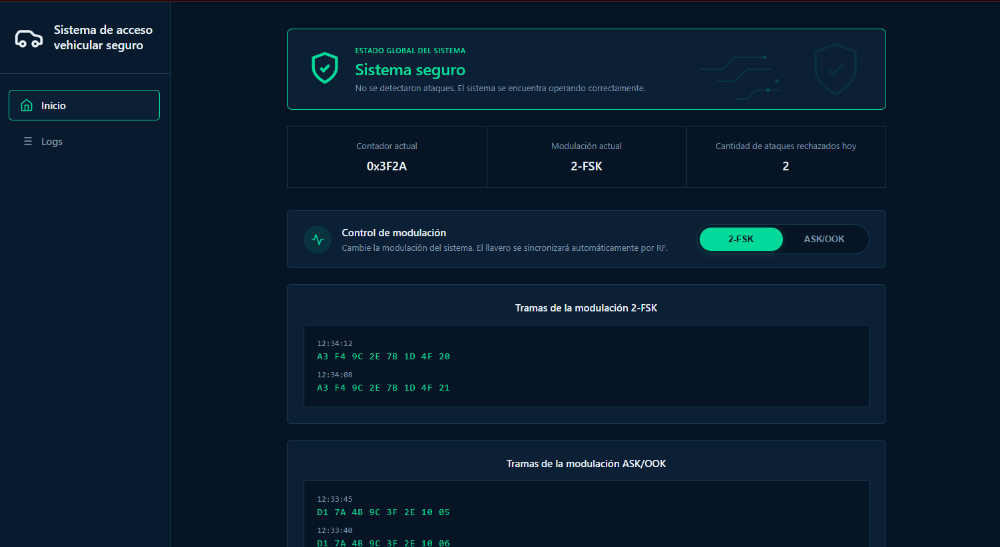
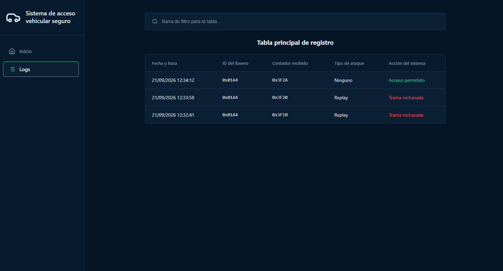

# **Taller de Proyecto II - Grupo A1** 

## **Bitácora** 

**Sistema de Acceso Vehicular Seguro (Rolling code con AES-128)** 

### **Grupo de Desarrollo** 

- Gonzalez Seijas, Juan Blas – 03113/7 

- Lumbreras, Valentin – 02684/7 

- Medina, Alan – 01551/9 

#### **Fecha 27/08/2026** 

- Qué se hizo? 

   - Asignación del tema del proyecto por parte de la cátedra: Sistema de Acceso Vehicular Seguro (Rolling Code con AES-128) 

   - Primera reunión con el docente a cargo (Alan) para discutir la idea general del proyecto: Tiempos, requerimientos, materiales, etc 

- Decisión Tomada / Acuerdos 

   - Utilizar cifrado simétrico AES-128 sobre radiofrecuencia y una interfaz web para el monitoreo de eventos 

- Próximo paso 

   - Iniciar la redacción del plan de Proyecto formal y la estructura de requerimientos y funcionalidades del sistema. 

#### **Fecha 30/08/2026** 

- Qué se hizo? 

   - Elaboración y estructuración **parcial** del documento “Plan de Proyecto” siguiendo las pautas e instrucciones de la cátedra. 

   - Definición del circuito y esquema del sistema: Alimentación, circuito y nodos. 

   - Pensar cómo será la primera estructura del software a desarrollar 

- Próximo paso 

   - Finalizar los archivos entregables, avanzar con el video de presentación del Plan de Proyecto, resolver dudas con el docente Alan. 

 #### **Fecha 05/09/2026** 

- Qué se hizo? 

   -Investigación sobre la sincronización de la modulación entre el llavero y el auto. Se evaluó el uso del protocolo ESP-NOW, que permite una comunicación inalámbrica rápida y eficiente entre placas ESP32.

- Decisión tomada 

   -  Se descartó utilizar ESP-NOW. Al operar en la banda de 2.4 GHz, requiere que el microcontrolador esté activo, lo cual es incompatible con el modo Deep Sleep en el que operará el llavero para optimizar su consumo energético.
   -   Además, su implementación interferiría con los objetivos de la cátedra, que exige resolver el enlace operando estrictamente en la banda de 433,92 MHz configurando los transceptores CC1101.

- Próximo paso 

   - Se continuara investigando otras alternativas para lograr que el emisor y receptor puedan sincronizar su modulación de manera automatica.

#### **Fecha 10/09/2026** 

- Qué se hizo? 

   - Investigación acerca de cómo comunicar e implementar el cambio de modulación, el cual se realiza desde la página web y debe actualizarse en los nodos emisor y receptor. 

   - Reunión con el docente a cargo para discutir las posibles soluciones a la comunicación del cambio de modulación. 

- Decisión tomada 

   - Se optó por comunicar el cambio de modulación a los dispositivos emisor y receptor a través de RF ya que es la forma más eficiente. Las opciones contempladas para implementar son: una ventana de escucha ACK luego de la transmisión o una escucha periódica asincrónica con polling. 

- Próximo paso 

   - Analizar las opciones y elegir la más eficiente. 

   - Finalizar el plan de proyecto y realizar el video de presentación.

 #### **Fecha 12/09/2026** 

- Qué se hizo? 

   - Se analizaron las opciones para la implementación del cambio de modulación, teniendo en cuenta factores como la eficiencia energética, la latencia de respuesta y la complejidad de realización.
   - Se realizaron las diapositivas para la presentación del proyecto y se grabó el video correspondiente.
   - Se entregó el plan de proyecto a traves de Ideas.

- Decisión tomada 

   -  Para comunicar el cambio de modulación se eligó la opción de una ventana de escucha ACK en el emisor luego de la transmisión. 

- Próximo paso 

   - Esperar la entrega de los componentes de hardware para comenzar a implementar el proyecto.

 #### **Fecha 19/09/2026** 

- Qué se hizo? 

   - Reunión de consulta y reestructuración del proyecto en base al hardware específico que suministrará la cátedra.

- Decisión tomada 

   -  Se acordó avanzar prioritariamente con el desarrollo del entorno web y la lógica de software aislada mientras se aguarda la entrega de los componentes físicos.

- Próximo paso 

   - Iniciar en un principio con lo que es el desarrollo web y de manera secundaria la estructura de pruebas unitarias.

 #### **Fecha 21/09/2026** 

- Qué se hizo? 

   - Se investigaron y analizaron distintas propuestas para reestructurar el proyecto en base a los materiales asignados por la catedra(2 arduino UNO, 1 esp32, 2 cc1101, 1 servo y 1 fuente alimentación). El principal desafío fue encontrar una solución para implementar el nodo interceptor sin un transceptor cc1101.
   - Documentación: [Análisis de componentes asignados](https://docs.google.com/document/d/149fhd8uxdqXGCKvHql11_JB6_TIA2iZjkLbXKHnm_U8/edit?usp=sharing)

- Decisión tomada 

   - Se decidió utilzar el esp32 para el nodo receptor y los 2 arduinos UNO para los nodos emisor e interceptor.
   - Los 2 transceptores cc1101 se utilizarán en los nodos emisor y receptor.
   - Se encontraron y listaron algunas soluciones para la implementación del nodo interceptor, las cuales se encuentran en este documento [link](https://docs.google.com/document/d/1W8DgCcCBv0kgthI1AKxEsXmWdtwS-Hq3AYD4_JGeEIY/edit?usp=sharing) 

- Próximo paso 

   - Analizar las soluciones para implementar el interceptor y elegir entre ellas.

 #### **Fecha 22/09/2026** 

- Qué se hizo? 
   - Se analizaron y evaluaron distintas tecnologías para el desarrollo de la interfaz, considerando el uso de frameworks como React o Vue.

   - Se maquetaron las vistas principales respetando la estructura de los wireframes, incorporando el panel de estado, métricas y registros de auditoría.

   - Se comenzó con la implementación del frontend de la plataforma web.
 
- Decisión tomada 
   
   - Se decidió utilizar HTML5, CSS3 y JavaScript de forma directa sin implementar frameworks pesados.

   - Esta opción se consideró la más ágil y simple para esta etapa del proyecto, ya que elimina la complejidad de empaquetado.

   - Se acordó que, en caso de disponer de tiempo adicional en el futuro, se evaluará la migración a un framework como React para escalar el proyecto.

- Próximo paso 
   - Comenzar con el desarrollo del backend en Python.

   - Estructurar el servidor local para la recepción de eventos y preparar la comunicación en mediante WebSockets.

  
  
<em>Figura 1: Vista principal del panel de monitoreo y estado de seguridad.</em>

  
  
<em>Figura 2: Vista de la tabla de registros.</em>

